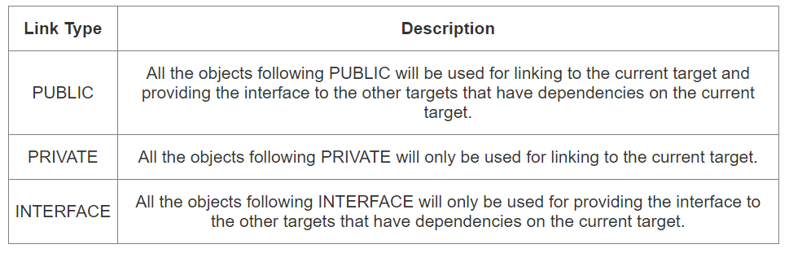
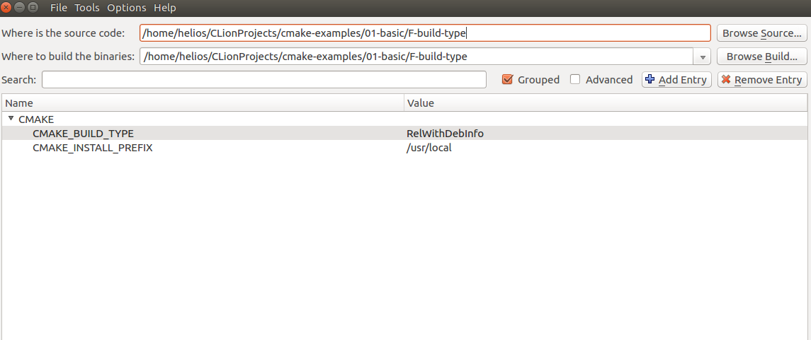
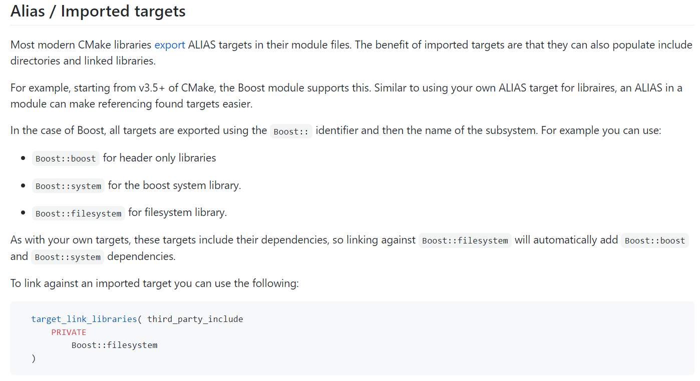
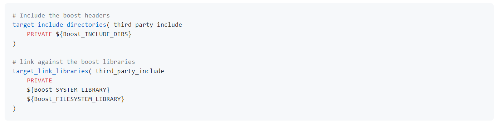
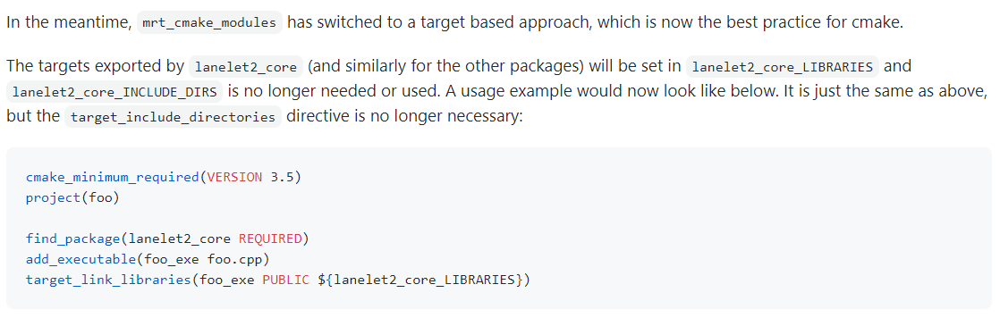
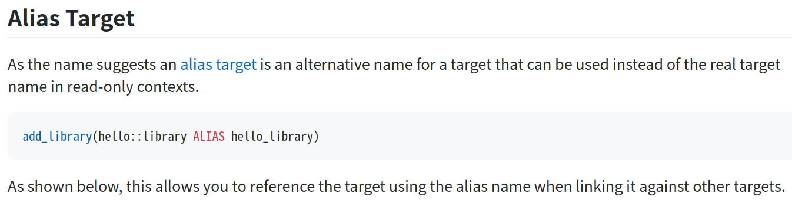

# CmakeLists 实战

## 参考资料

- [例程](https://github.com/ttroy50/cmake-examples)、[基础例程]([https://github.com/ttroy50/cmake-examples/tree/master/01-basic)

* [定义、术语](https://cmake.org/cmake/help/latest/manual/cmake-language.7.html)
* [官网](https://cmake.org/cmake/help/latest/index.html)


## 语法

1. 指令大小写无关（如add_library等价于ADD_LIBRARY）
2. 参数和变量、OPTION大小写相关（如REQUIRED不能写成required）


## cmake 变量设置和引用

```plain
set(SOURCES
    src/Hello.cpp
    src/main.cpp
)
message(${SOURCES})  # src/Hello.cppsrc/main.cpp
```

PS：

1. 单个variable有多个arguments时，用分号将argument进行concatenate后再进行赋值
2. 经测试，但在message显示时，不会出现分号
3. 变量的引用，不同于bash可以不加上{}，在CMakelists中一定要加上


### 常用函数/宏

#### 构建库

```cmake
add_library(target_name STATIC 文件名)     # 静态库
add_library(target_name SHARED 文件名)  # 动态库     
```

- 构建的library可以不写全名字，如只写hello，cmake会自动补全为`libhello.so`或`libhello.a`

#### 构建可执行文件

```plain
add_executable(target_name 文件名)
```

#### 添加头文件搜索路径

方法一：

```cmake
# 当前包的头文件目录要放在前面
include_directories(
 include  # 相对于当前CmakeLists所在的文件目录
 ${catkin_INCLUDE_DIRS}
)
```

- 控制追加的路径是放在原来的前面还是后面（设置参数 ON）

```cmake
set(cmake_include_directorirs_before ON)
set(cmake_include_directorirs_after ON)
```

- `#include <file.h>`时对应的位置是相对于`include_directories`中导入的路径

例如：`include_directories`的路径是/include/；头文件在/include/package_name/header.h则最终的编写应为`#include <package_name/header.h>`

方法二：

```cmake
target_include_directories（target_name
    PUBLIC
        头文件目录）
```

- 方法二的头文件路径仅适用特定的`target`，方法一的适用于所有`target`

#### 添加额外的库搜索路径

```cmake
link_directories(dir_path)
```


#### 链接可执行文件与库

```cmake
target_link_libraries(target_name library_name)
```

* [有关关键词option： private、public、target 的区别]([https://leimao.github.io/blog/CMake-Public-Private-Interface/](https://leimao.github.io/blog/CMake-Public-Private-Interface/))：

本质是用于描述一个链接是否能被继承

`private`(default)：目标文件A所链接过的库不会被目标文件B 继承

`public`：目标文件A所链接过的库可被目标文件B 继承

`interface`：目标文件A所链接过的库不可被目标文件B继承，但是目标文件C链接B时可链接到目标文件A的链接库

​	有如下案例：比如给定三个文件，分别为可执行文件A`eat_apple`；库A`fruit` (有size和color两个函数)；库B`apple_libraries`(有apple_size这个函数，该实现依赖`fruit库`调用了size函数)  。如果，在实现库B到库A的link时，采用private关键词；eat_apple中调用了apple_size这个函数，依赖了apple_libraries库。此时可执行文件A到库B的link无论使用哪种关键词，都会有link错误。因为前面采用了private关键词，库A到库B的link不会被可执行文件A继承。需要将库B到库A的private link改为public link才行。



#### [修改target属性](https://cmake.org/cmake/help/v3.18/manual/cmake-properties.7.html#target-properties)

```cmake
set_target_properties(target1 target2 ...
                      PROPERTIES prop1 value1
                      prop2 value2 ...)
```

* 修改文件生成名前/后缀

```cmake
set_target_properties(lib_cpp PROPERTIES PREFIX "")               # 指定前缀
set_target_properties(lib_cpp PROPERTIES OUTPUT_NAME "lib_cpp")   #  指定文件名
set_target_properties(lib_cpp PROPERTIES SUFFIX ".so")            #  指定后缀
```

原来默认生成`lib_cpp.cpython-37m-x86_64-linux-gnu.so`现在是`lib_cpp.so`；更多属性配置可参考[link](https://cmake.org/cmake/help/latest/manual/cmake-properties.7.html#target-properties)

#### [指明链接依赖](https://cmake.org/cmake/help/latest/command/add_dependencies.html)

- 指明在target生成前，需要先生成某些`target`

```cmake
add_dependencies(<target> [<target-dependency>]...)
```

#### [find_package](https://cmake.org/cmake/help/v3.18/command/find_package.html?highlight=find_package)

```plain
find_package(<PackageName> [version] [EXACT] [QUIET] [MODULE]
             [REQUIRED] [[COMPONENTS] [components...]]
             [OPTIONAL_COMPONENTS components...]
             [NO_POLICY_SCOPE])
```

- 指定路径

```cmake
find_package(PCL REQUIRED 
PATHS  库路径
NO_DEFAULT_PATH)  # 只在PATHS路径下寻找，不使用默认的搜索路径
```

- `find_package`后会产生相关的变量，例如，`<package_name>_INCLUDE_DIRS` or`<package_name>_INCLUDES` or `<package_name>_INCLUDE_DIR`具体看相关模块的设计

- cmake modules 指文件`FindXXX.cmake`，要指定 cmake module的搜索路径，可以配置如下参数；不过它也有默认的搜索路径即cmake安装路径下的Module目录（e.g. /usr/share/cmake-3.16/Modules），在默认路径下没找到，才去CMAKE_MODULE_PATH下找

```cmake
set(CMAKE_MODULE_PATH 路径名)
```

- `find_packaege`还有一种`Config Mode `，当没找到`FindXXX.cmake`时将按特定的规则进行搜寻，具体可参考[英文文档](https://cmake.org/cmake/help/latest/command/find_package.html#search-procedure)和[中文说明](https://zhuanlan.zhihu.com/p/50829542)（PATH环境变量也会起作用），该种模式下找的是`GeographicLibConfig.cmake`或`geographiclib_config.cmake`。可添加的搜索路径为

```cmake
<package>_DIR
CMAKE_PREFIX_PATH
CMAKE_FRAMEWORK_PATH
CMAKE_APPBUNDLE_PATH
PATH
```

- `find_package`中如果find的包是`catkin`，则`components`用于将`components`涉及的包的环境变量都统一到`catkin_ prefix`的环境变量中。[用与节省敲代码的时间(typing time)](http://wiki.ros.org/catkin/CMakeLists.txt#Why_Are_Catkin_Packages_Specified_as_Components.3F)


#### [打印信息](https://cmake.org/cmake/help/latest/command/message.html)

```cmake
message(STATUS|WARNING|FATAL|SEND_ERROR ${})# 这种形式一定要加STATUS这些option
message("...")
```


#### 配置参数

- 配置环境变量

```cmake
set(env{变量名} 值)  # 获取环境变量 env{变量名} 
e.g 家目录
$env{HOME}
```


#### ros: catkin_package

* [官方文档1](http://wiki.ros.org/catkin/CMakeLists.txt#catkin_package.28.29)、[官方文档2](https://docs.ros.org/en/groovy/api/catkin/html/dev_guide/generated_cmake_api.html#catkin_package)
* 作用：安装`package.xml`；生成可被其他package调用的配置文件(即.config或.cmake文件)。使其他包`find_package`时可以获取这个包的相关信息，如依赖的头文件、库、CMake变量

```plain
catkin_package(
  INCLUDE_DIRS include
  CATKIN_DEPENDS cloud_msgs
  DEPENDS PCL
)
add_executable(imageProjection src/imageProjection.cpp)
add_executable(featureAssociation src/featureAssociation.cpp)
add_executable(mapOptmization src/mapOptmization.cpp)
add_executable(transformFusion src/transformFusion.cpp)
```

* 并不会将当前的include copy到devel目录中

* 需要在声明targets前（即使用add_library()或add_executable().前） 调用该宏


#### [OPTION 命令](https://cmake.org/cmake/help/v3.20/command/option.html)

```cmake
option(<variable> "<help_text>" [value])
```


#### 安装

- 可以安装的内容：编译产生的target文件（即可执行文件、库文件）；其他文件

- 若要指定安装路径：

方法一：命令行

```bash
$ cmake .. -DCMAKE_INSTALL_PREFIX=/install/location
```

方法二：cmake-gui等图形界面进行


- 指定安装的内容和相对路径：
  安装可执行文件，并安装到到指定目录：`${CMAKE_INSTALL_PREFIX}/bin`

```plain
install (TARGETS <target_name>
    DESTINATION bin)
```

​		安装库文件，并安装到指定目录：`${CMAKE_INSTALL_PREFIX}/lib`

```plain
install (TARGETS <target_name>
    LIBRARY DESTINATION lib)
```

​		安装头文件（即把整个目录拷贝过去）

```plain
install(DIRECTORY ${PROJECT_SOURCE_DIR}/include/
    DESTINATION include)
```

​		安装配置文件，拷贝到`${CMAKE_INSTALL_PREFIX}/etc`

```plain
install (FILES <file_name>
    DESTINATION etc)
```

- `make install`后 CMake 会生成 install_manifest.txt文件（含安装的文件路径，到时可基于这个文件删除安装文件）

```plain
e.g.
/usr/local/include/ceres/autodiff_cost_function.h
/usr/local/include/ceres/autodiff_first_order_function.h
/usr/local/include/ceres/autodiff_local_parameterization.h
```

- 默认安装路径

```plain
/usr/local/include
/usr/local/bin
/usr/local/lib/cmake
```


#### 导入额外的CMAKE代码

- 方法一：

```cmake
include(<file|module> [OPTIONAL] [RESULT_VARIABLE <var>]
                      [NO_POLICY_SCOPE])
```

从某个文件(CMakeLists.txt)或模块(.cmake)中导入Cmake代码；未指定地址时，将在**CMAKE_MODULE_PATH**中寻找

```cmake
set(VTK_CMAKE_DIR "${VTK_SOURCE_DIR}/CMake")
set(CMAKE_MODULE_PATH ${VTK_CMAKE_DIR} ${CMAKE_MODULE_PATH})
include(vtkCompilerChecks)  # /VTK-8.2.0/CMake/vtkCompilerChecks.cmake
```

- 方法二：导入CMakeLists.txt，source_dir对应CMakeLists.txt的所在目录

```cmake
add_subdirectory(source_dir [binary_dir] [EXCLUDE_FROM_ALL])
```


#### [执行命令行](https://blog.csdn.net/qq_28584889/article/details/97758450)

```cmake
															# 相关待执行的命令																													# 存储标准输出的变量
execute_process(COMMAND python -c "from sysconfig import get_paths;print(get_paths()['include'])" OUTPUT_VARIABLE DUMMY)
```


## 实例

### 基本模板

```cmake
cmake_minimum_required(VERSION 3.0.2)
project(pysript)

## Compile as C++11, supported in ROS Kinetic and newer
# add_compile_options(-std=c++11)

## Find catkin macros and libraries
## if COMPONENTS list like find_package(catkin REQUIRED COMPONENTS xyz)
## is used, also find other catkin packages
find_package(catkin REQUIRED)

## System dependencies are found with CMake's conventions
# find_package(Boost REQUIRED COMPONENTS system)

## Uncomment this if the package has a setup.py. This macro ensures
## modules and global scripts declared therein get installed
## See http://ros.org/doc/api/catkin/html/user_guide/setup_dot_py.html
# catkin_python_setup()

################################################
## 构建 ROS messages, services and actions ##
################################################

## 步骤：
## * 假定 `MSG_DEP_SET` 是一系列要使用相关消息类型的包 e.g. std_msgs, actionlib_msgs, ...
##   * 1. 在package.xml中：
##   * 1.1 增加build_depend tag for "message_generation"
##   * 1.2 增加build_depend and a exec_depend tag for each package in MSG_DEP_SET
##   * If MSG_DEP_SET isn't empty the following dependency has been pulled in
##     but can be declared for certainty nonetheless:
##   * 增设exec_depend tag for "message_runtime"
## * 2. 在CMakeLists.txt中：
##   * 2.1 add "message_generation" and every package in MSG_DEP_SET to
##     find_package(catkin REQUIRED COMPONENTS ...)
##   * 2.2 add "message_runtime" and every package in MSG_DEP_SET to
##     catkin_package(CATKIN_DEPENDS ...) 
##   * uncomment the add_*_files sections below as needed
##     and list every .msg/.srv/.action file to be processed
##   * uncomment the generate_messages entry below
##   * add every package in MSG_DEP_SET to generate_messages(DEPENDENCIES ...)

## 生成自定义的消息类型（build阶段，生成在build/下）
# add_message_files(
#   FILES   # (argument)
#   Message1.msg
#   Message2.msg
# )

## Generate services in the 'srv' folder
# add_service_files(
#   FILES
#   Service1.srv
#   Service2.srv
# )

## Generate actions in the 'action' folder
# add_action_files(
#   FILES
#   Action1.action
#   Action2.action
# )

## 根据依赖，生成msg源文件（run阶段，生成在devel/下）
# generate_messages(
#   DEPENDENCIES
#   std_msgs  # Or other packages containing msgs
# )

################################################
## Declare ROS dynamic reconfigure parameters ##
################################################

## To declare and build dynamic reconfigure parameters within this
## package, follow these steps:
## * In the file package.xml:
##   * add a build_depend and a exec_depend tag for "dynamic_reconfigure"
## * In this file (CMakeLists.txt):
##   * add "dynamic_reconfigure" to
##     find_package(catkin REQUIRED COMPONENTS ...)
##   * uncomment the "generate_dynamic_reconfigure_options" section below
##     and list every .cfg file to be processed

## Generate dynamic reconfigure parameters in the 'cfg' folder
# generate_dynamic_reconfigure_options(
#   cfg/DynReconf1.cfg
#   cfg/DynReconf2.cfg
# )

###################################
## catkin specific configuration ##
###################################
## The catkin_package macro generates cmake config files for your package
## Declare things to be passed to dependent projects
## INCLUDE_DIRS: uncomment this if your package contains header files
## LIBRARIES: libraries you create in this project that dependent projects also need
## CATKIN_DEPENDS: catkin_packages dependent projects also need
## DEPENDS: system dependencies of this project that dependent projects also need
# catkin_package(
# #  INCLUDE_DIRS include
# #  LIBRARIES pysript
# #  CATKIN_DEPENDS other_catkin_pkg
# #  DEPENDS system_lib
# )

###########
## 编译 ##
###########

##指定额外的头文件搜索目录
## Your package locations should be listed before other locations
include_directories(
# include
# ${catkin_INCLUDE_DIRS}
)

## 构建库
# add_library(${PROJECT_NAME}
#   src/${PROJECT_NAME}/pysript.cpp
# )

## Add cmake target dependencies of the library
## as an example, code may need to be generated before libraries
## either from message generation or dynamic reconfigure
# add_dependencies(${PROJECT_NAME} ${${PROJECT_NAME}_EXPORTED_TARGETS} ${catkin_EXPORTED_TARGETS})

## Declare a C++ executable
## With catkin_make all packages are built within a single CMake context
## The recommended prefix ensures that target names across packages don't collide
# add_executable(${PROJECT_NAME}_node src/pysript_node.cpp)

## Rename C++ executable without prefix
## The above recommended prefix causes long target names, the following renames the
## target back to the shorter version for ease of user use
## e.g. "rosrun someones_pkg node" instead of "rosrun someones_pkg someones_pkg_node"
# set_target_properties(${PROJECT_NAME}_node PROPERTIES OUTPUT_NAME node PREFIX "")

## Add cmake target dependencies of the executable
## same as for the library above
# add_dependencies(${PROJECT_NAME}_node ${${PROJECT_NAME}_EXPORTED_TARGETS} ${catkin_EXPORTED_TARGETS})

## Specify libraries to link a library or executable target against
# target_link_libraries(${PROJECT_NAME}_node
#   ${catkin_LIBRARIES}
# )

#############
## 安装 ##
#############

# all install targets should use catkin DESTINATION variables
# See http://ros.org/doc/api/catkin/html/adv_user_guide/variables.html

## Mark executable scripts (Python etc.) for installation
## in contrast to setup.py, you can choose the destination
# catkin_install_python(PROGRAMS
#   scripts/my_python_script
#   DESTINATION ${CATKIN_PACKAGE_BIN_DESTINATION}
# )

## Mark executables for installation
## See http://docs.ros.org/melodic/api/catkin/html/howto/format1/building_executables.html
# install(TARGETS ${PROJECT_NAME}_node
#   RUNTIME DESTINATION ${CATKIN_PACKAGE_BIN_DESTINATION}
# )

## Mark libraries for installation
## See http://docs.ros.org/melodic/api/catkin/html/howto/format1/building_libraries.html
# install(TARGETS ${PROJECT_NAME}
#   ARCHIVE DESTINATION ${CATKIN_PACKAGE_LIB_DESTINATION}
#   LIBRARY DESTINATION ${CATKIN_PACKAGE_LIB_DESTINATION}
#   RUNTIME DESTINATION ${CATKIN_GLOBAL_BIN_DESTINATION}
# )

## Mark cpp header files for installation
# install(DIRECTORY include/${PROJECT_NAME}/
#   DESTINATION ${CATKIN_PACKAGE_INCLUDE_DESTINATION}
#   FILES_MATCHING PATTERN "*.h"
#   PATTERN ".svn" EXCLUDE
# )

## Mark other files for installation (e.g. launch and bag files, etc.)
# install(FILES
#   # myfile1
#   # myfile2
#   DESTINATION ${CATKIN_PACKAGE_SHARE_DESTINATION}
# )

#############
## 测试 ##
#############

## Add gtest based cpp test target and link libraries
# catkin_add_gtest(${PROJECT_NAME}-test test/test_pysript.cpp)
# if(TARGET ${PROJECT_NAME}-test)
#   target_link_libraries(${PROJECT_NAME}-test ${PROJECT_NAME})
# endif()

## Add folders to be run by python nosetests
# catkin_add_nosetests(test)
```

 

### 用 target based的方法链接库与可执行文件

* 此处的`target`根据上下文，应该指的是`library`这种target，而不是executable file；且是`alias target`
* 作用：采用`taget-based`的方法可以不用再`include_directory`，只需要`target_link_libraries`就能完成编译（[link](https://github.com/ttroy50/cmake-examples/tree/master/01-basic/H-third-party-library)）
* 案例1：



等价于



* 案例2（[link](https://github.com/fzi-forschungszentrum-informatik/Lanelet2/issues/39)）



* target-based的target（library）采用的是alias targets，其生成可参考（[link](http://www.smartredirect.de/redir/clickGate.php?u=IgKHHLBT&m=1&p=8vZ5ugFkSx&t=vHbSdnLT&st=&s=&url=https%3A%2F%2Fgithub.com%2Fttroy50%2Fcmake-examples%2Fblob%2Fmaster%2F01-basic%2FD-shared-library%2FREADME.adoc&r=https%3A%2F%2Fshimo.im%2Fdocs%2FgjWXYXXprqjtDDgk)）




### [在ros的package中使用python](https://roboticsbackend.com/ros-import-python-module-from-another-package/)


## 常用指令（cmake和make）

### 指定ninja编译

```bash
$ cmake .. -G Ninja # 指定generator，生成ninja文件
$ ninja  # 执行build
```

- 其速度比make编译和构建工程快但报错信息没有语法高亮

### 看更多编译细节

```bash
$ make VERBOSE=1
```


## DEBUG

1. `No CMAKE_CXX_COMPILER could be find`

```plain
$ sudo apt-get install build-essential
```

2. 未定义的引用（`undefined reference`）

一般来说有两种情况。一种是没下载相关的库；一种是库的冲突，比如ros的opencv库与从源码编译安装到系统的opencv库发生冲突，至依赖被覆盖而使目标文件无法成功链接到库。可卸载安装到系统的opencv库（如用sudo make uninstall来卸载）；一种是已下载但没找到，

3. `imported target "..." references the file   "..." but this file does not exist.`

[locate 定位相关位置后，使用软链接](https://blog.csdn.net/weixin_45617478/article/details/104513572)

4. `no such file or directory`：没有找到头文件的路径，导入头文件失败。在已有头文件的情况下，可直接添加绝对路径进行搜索

```cmake
include_directories(
   include
   绝对路径   # e.g. /home/include
)
```

