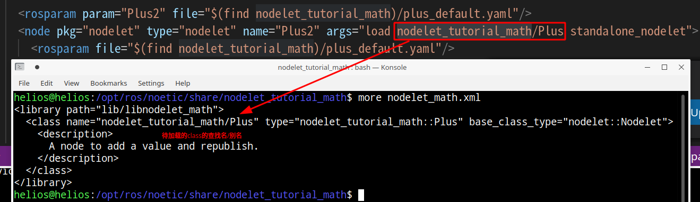

# [pluginlib](http://wiki.ros.org/pluginlib/Tutorials/Writing%20and%20Using%20a%20Simple%20Plugin)

[http://wiki.ros.org/pluginlib]

- 直接catkin_make然后调用`devel/lib/pluginlib_tutorials_/polygon_loader`即可看到效果


插件：动态库中的类（Plugins are dynamically loadable classes that are loaded from a runtime library (i.e. shared object, dynamically linked library）


# 如何让ros系统找到插件？

1. 构建`plugin description` 文件

``` xml
<!--包含插件的所在位置/插件名/插件类型-->
<library path="lib/librectangle">
  <class type="rectangle_namespace::Rectangle" base_class_type="polygon_namespace::Polygon">
  <description>
  This is a rectangle plugin
  </description>
  </class>
</library>
```

2. package.xml中显式指明插件的位置（i.e. 描述文件的位置），让ros系统能够找到插件

```xml
<export>
  <!--  package name       plugin name -->
  <polygon_interface plugin="${prefix}/rectangle_plugin.xml" />
</export>
```


```
├── CMakeLists.txt -> /opt/ros/noetic/share/catkin/cmake/toplevel.cmake
├── pluginlib.md
└── pluginlib_tutorials_
    ├── CMakeLists.txt
    ├── include
    │   └── pluginlib_tutorials_
    │       ├── polygon_base.h     // 插件基类头文件
    │       └── polygon_plugins.h  // 插件继承类头文件
    ├── package.xml
    ├── polygon_plugins.xml        // 插件的描述性文件，让ros系统能找到plugin
    └── src
        ├── polygon_loader.cpp
        └── polygon_plugins.cpp
```


# [利用pluginlib编写插件的步骤](https://blog.csdn.net/jinking01/article/details/79414343)

1. 编写插件基类，定义统一接口（如果为现有接口编写插件，则跳过该步）

2. 编写插件类，继承插件基类

3. 导出插件，并编译为动态库

4. 将插件加入ROS系统，使其可识别和管理


### 应用场景

- 较大的数据通讯频繁的场合：可将它们放置于同一进程中实现数据共享，减少ros tcp通讯，可提高数据交互的效率

- high throughput data flows can be composed of many nodelets and then loaded into the same process to avoid copying and network traffic.


## 咩时候用nodelet？

- ros node节点的通信是进程的通信，采用ros tcp的方法。当node与node之间传输的数据体量较大，通信（比如要反序列和序列化）的开销也是比较大的。因此若**希望减少节点与节点间通讯的开销来提高实时性**，这就需要用到nodelet技术。具体例子，比如跑一些点云的预处理模块，涉及到采集的点云转换成ros数据，点云滤波去离群点，点云裁剪，点云去地面等`node` 节点，这些节点允许放在一个进程作为单独的线程去跑（`ros nodelet`程序能将一个`node` 进程节点转换为`nodelet`线程节点），然后想提高实时性就可以用到。【总体有种进程通信改为线程通信的感jio】


## 显示当前系统的nodelet和其描述文件

```bash
$ rospack plugins --attrib=plugin nodelet   # 显示.xml文件
$ rosrun nodelet declared_nodelets          # 显示ros工作空间中已有的nodelet
```


## 启动NodeletManager

每个nodelet需要一个NodeletManager来管理，启动NodeletManager的方法：

```
// 利用"__name:=nodelet_manager"来重命名节点管理器的节点名
$ rosrun nodelet nodelet manager __name:=nodelet_manager 
```

等价于在launch文档中的：

``` xml
<node pkg="nodelet" type="nodelet" name="nodelet_manager"  args="manager"/>
```

## 加载nodelet到NodeletManager

```bash
# Launch a nodelet of type pkg/Type(包名/可执行文件名) on manager manager
$ rosrun nodelet nodelet load nodelet_tutorial_math/Plus nodelet_manager \
		__name:=nodelet1 nodelet1/in:=foo _value:=1.1   
		# 此处重命名分别为nodelet节点；topic
```

等价于在launch文档中的：

``` xml
<node pkg="nodelet" type="nodelet" name="Plus" args="load nodelet_tutorial_math/Plus nodelet_manager">
    <remap from="/Plus/out" to="remapped_output"/>
</node>
```

## nodelet launch文档解读

```xml
<!--使用参数配置文件；将Plus nodelet加载到nodelet manager-->
<rosparam param="Plus2" file="$(find nodelet_tutorial_math)/plus_default.yaml"/>
<node pkg="nodelet" type="nodelet" name="Plus2" args="load nodelet_tutorial_math/Plus nodelet_manager">
    <rosparam file="$(find nodelet_tutorial_math)/plus_default.yaml"/>
</node>

<!--standalone模型，不需要加载到nodelet manager，退化到node-->
<node pkg="nodelet" type="nodelet" name="Plus3" args="standalone nodelet_tutorial_math/Plus">
    <param name="value" type="double" value="2.5"/>
    <remap from="Plus3/in" to="Plus2/out"/>
</node>
```


