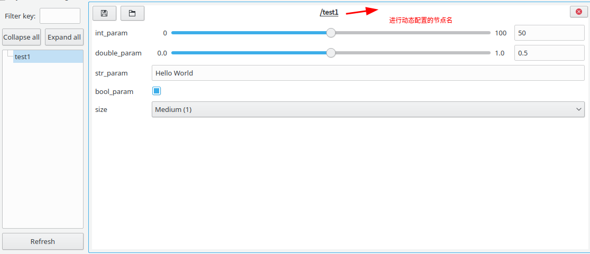

# 创建配置文件

1. 创建package `catkin_create_pkg --rosdistro ROSDISTRO dynamic_tutorials rospy roscpp dynamic_reconfigure` 
2. 创建`cfg/Tutorials.cfg` 文件

```python
#!/usr/bin/env python
PACKAGE = "dynamic_tutorials"

from dynamic_reconfigure.parameter_generator_catkin import *

gen = ParameterGenerator()
#gen.add(参数名称，参数类型，位掩码，参数描述，默认值，最小值，最大值)
gen.add("int_param",    int_t,    0, "An Integer parameter", 50,  0, 100)
gen.add("double_param", double_t, 0, "A double parameter",    .5, 0,   1)
gen.add("str_param",    str_t,    0, "A string parameter",  "Hello World")
gen.add("bool_param",   bool_t,   0, "A Boolean parameter",  True)

# 枚举类型
size_enum = gen.enum([ gen.const("Small",      int_t, 0, "A small constant"),
                       gen.const("Medium",     int_t, 1, "A medium constant"),
                       gen.const("Large",      int_t, 2, "A large constant"),
                       gen.const("ExtraLarge", int_t, 3, "An extra large constant")],
                     "An enum to set size")

gen.add("size", int_t, 0, "A size parameter which is edited via an enum", 1, 0, 3, edit_method=size_enum)

# gen.generate("包名", "节点名", "Tutorials")
# 参数二：仅用于生成文档
# 参数三：生成文件的前缀(e.g.  "<name>Config.h" for c++, or "<name>Config.py" for python
exit(gen.generate(PACKAGE, "dynamic_tutorials", "Tutorials"))
```


```python
#!/usr/bin/env python

import dynamic_reconfigure.parameter_generator_catkin as param

gen = param.ParameterGenerator()

## 自动控制部分
auto_func_group = gen.add_group("Auto function control");
gain_auto_desc = "Control the Gain Auto function."

gain_auto = gen.enum([
        gen.const("Gain_Manual", param.str_t, "Manual", "Disables the Gain Auto function."),
        gen.const("Gain_Continuous", param.str_t, "Continuous", "Sets the auto function mode of operation to - continuous."),
    ], gain_auto_desc)

auto_func_group.add("Gain_auto", param.str_t, 0, gain_auto_desc, default="Continuous", edit_method=gain_auto)

exposure_auto_desc = "Control the exposure auto function."
exposure_auto = gen.enum([
        gen.const("Exposure_Manual", param.str_t, "Manual", "Disables the exposure auto function."),
        gen.const("Exposure_Continuous", param.str_t, "Continuous", "Sets the exposure auto function mode of operation to - continuous."),
    ], exposure_auto_desc)

auto_func_group.add("Exposure_auto", param.str_t, 0, exposure_auto_desc, default="Continuous", edit_method=exposure_auto)

## 手动控制部分
manual_func_group = gen.add_group("Manual function control")

exposure_time_desc = "This float value sets the cameras exposure time in microseconds."
manual_func_group.add("Exposure_time", param.double_t, 0, exposure_time_desc, default=59, min=0, max=200)

gain_desc = "This float value sets the camera's gain."
manual_func_group.add("Gain", param.double_t, 0, gain_desc, default=1, min=0, max=100)
manual_func_group.add("Red_gain", param.double_t, 0, gain_desc, default=60, min=0, max=100)
manual_func_group.add("Green_gain", param.double_t, 0, gain_desc, default=60, min=0, max=100)
manual_func_group.add("Blue_gain", param.double_t, 0, gain_desc, default=60, min=0, max=100)

gen.add("Trigger_WB", param.bool_t, 0, "Trigger White Balance", default = True)
exit(gen.generate("mv_camera", "mv_camera", "Camera"))
```


# 其他

- 在`package.xml`中，给"dynamic_reconfigure"增设 build_depend and exec_depend 标签

- 在`CMakeLists.txt` 中

  - 增设 "dynamic_reconfigure" package到 find_package(catkin REQUIRED COMPONENTS ...)

  - 增设如下宏，以生成动态参数：
    generate_dynamic_reconfigure_options(
    cfg/DynReconf1.cfg
    cfg/DynReconf2.cfg
    )

- 补充：[c++调用](http://wiki.ros.org/dynamic_reconfigure/Tutorials/HowToWriteYourFirstCfgFile)时需要`add_dependencies(example_node ${PROJECT_NAME}_gencfg)`


# [调用动态配置python](http://wiki.ros.org/dynamic_reconfigure/Tutorials/SettingUpDynamicReconfigureForANode%28python%29)

- 创建文件`nodes/src/server.py`

```python
#!/usr/bin/env python

import rospy

from dynamic_reconfigure.server import Server
# Tutorial模块名由gen.generate函数决定
from dynamic_tutorials.cfg import TutorialsConfig

# 定义一个回调函数（当配置数据更新时，该部分即会触发）
def callback(config, level):
    rospy.loginfo("""Reconfigure Request: {int_param}, {double_param},\ 
          {str_param}, {bool_param}, {size}""".format(**config))
    return config

if __name__ == "__main__":
    # 初始化节点和实例化Server
    rospy.init_node("dynamic_tutorials", anonymous = False)
    srv = Server(TutorialsConfig, callback)
    rospy.spin()
```

- 添加可执行权限

```bash
$ chmod +x nodes/server.py
```

- 启动节点

```bash
$ rosrun rqt_reconfigure rqt_reconfigure
```

- 结果显示




# [调用动态配置c++](http://wiki.ros.org/dynamic_reconfigure/Tutorials/SettingUpDynamicReconfigureForANode%28cpp%29)http://wiki.ros.org/dynamic_reconfigure/Tutorials/SettingUpDynamicReconfigureForANode(cpp)#)

```
#include <ros/ros.h>

// 导入必要的头文件
#include <dynamic_reconfigure/server.h>
#include <dynamic_tutorials/TutorialsConfig.h>

// 参数动态更新时的回调函数
void callback(dynamic_tutorials::TutorialsConfig &config, uint32_t level) {
  ROS_INFO("Reconfigure Request: %d %f %s %s %d", 
            config.int_param, config.double_param, 
            config.str_param.c_str(), 
            config.bool_param?"True":"False", 
            config.size);
}

int main(int argc, char **argv) {
  ros::init(argc, argv, "dynamic_tutorials");

  // 传入配置类型，只要server一直存在，则会一直接收配置更新的request
  dynamic_reconfigure::Server<dynamic_tutorials::TutorialsConfig> server;
  // 构建回调函数并传入server
  dynamic_reconfigure::Server<dynamic_tutorials::TutorialsConfig>::CallbackType f;
  f = boost::bind(&callback, _1, _2);
  server.setCallback(f);

  ROS_INFO("Spinning node");
  ros::spin();
  return 0;
}
```

- 如果回调函数是一个成员函数时，应该使用 `f = boost::bind(&callback, x, _1, _2)` 其中 `x` 为实例 (or `this` if called from inside the class).


# 注意事项

- 无论是否动态调节参数，在初始化`Server`后总会触发一次回调函数