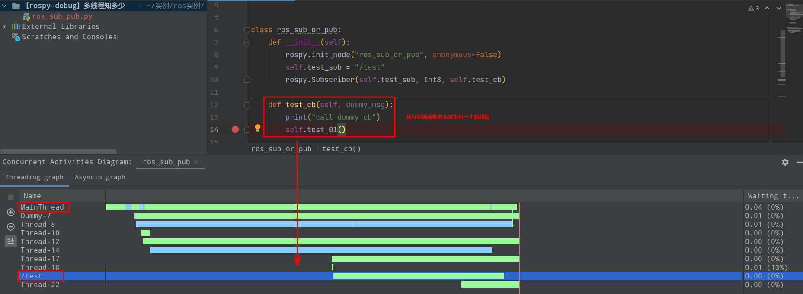

# rospy的回调函数

 

- `rospy`中处理回调函数时会派生出一个新的线程去执行（线程名与主题名相同）

> These threads are different from the main thread of your program.

- 拓展：如果有n个回调函数（处理的是不同的topic）则会派生出n个线程；如果有回调函数处理相同的topic则共用一个线程
- 注意：此处阐述的是`rospy`的回调函数的机制，在`roscpp`中会有所不同

# 参考资料

[1] https://nu-msr.github.io/me495_site/lecture08_threads.html#what-this-threading-model-means-for-you

