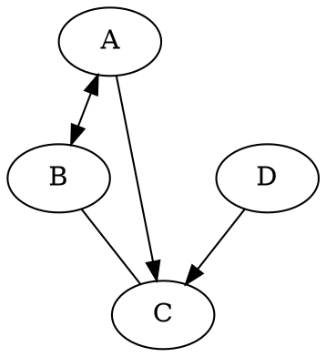

# DotPractice

Dot语言是开源工具包[Graphviz](http://graphviz.org/)的脚本语言，用于画图

## IDE

### Jetbrain

#### Dot Language

支持语法高亮、在线渲染和预览

#### [External Tool](https://stackoverflow.com/questions/52352836/visualise-dot-files-in-pycharm)

```
# Tools Setting
dot
-Tpng $FileName$ -o $FileNameWithoutExtension$.png
$FileDir$
```

## Install

```bash
$ sudo apt install graphviz
```

## Practice

[可视化TensorRT引擎](https://zhuanlan.zhihu.com/p/422108110)

## QuickUsage

- 编写demo.dot脚本



- 生成图片（需先下载graphviz）

```bash
$ dot demo.dot –Tpng –o demo.png
```


## Reference

- [csdn 基础用法](https://blog.csdn.net/jy692405180/article/details/52077979)
